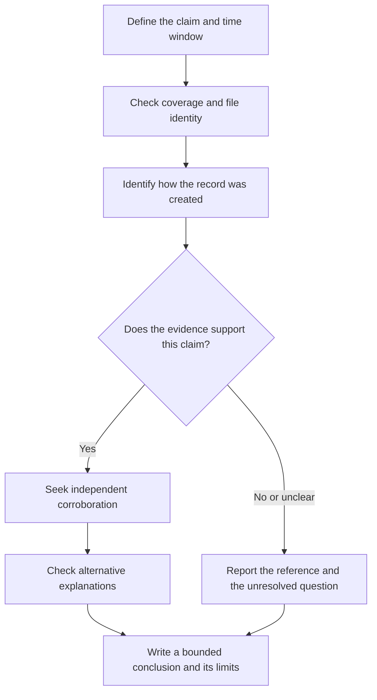

# Evidence of Program Execution

What evidence supports that a program executed, and what does each artifact actually prove?

| Field | Value |
|---|---|
| AUTHOR | DARKCYBE |
| EDITORIAL / RESEARCH ASSISTANCE | K-2AI // HOLONET |
| VALIDATION | SOURCE VALIDATED |
| PUBLISHED | Pending |
| LAST VERIFIED | 2026-09-11 — public-source review |
| SCOPE | Windows endpoint investigations; version and configuration limits below |

## TL;DR

A filename in a forensic report is a starting point, not a verdict. Separate four propositions:

**FILE PRESENCE ≠ ARTIFACT REFERENCE ≠ EVIDENCE CONSISTENT WITH EXECUTION ≠ DIRECTLY OBSERVED PROCESS CREATION**

Prefer process-creation telemetry when it exists. Otherwise, build a bounded inference from artifacts whose creation conditions you understand. State the host, file identity, time meaning and account context separately. Neither execution nor process creation alone establishes intent, successful completion or a particular person's actions.

## Why the distinction matters

The investigation question might be whether a downloaded tool merely arrived, whether Windows inventoried it, whether it ran, or whether it performed an alleged action. Those are different claims and require different evidence.

This guide uses “directly observed process creation” to mean a retained event produced by process monitoring—not a claim that an analyst watched the screen. It remains subject to provenance, coverage and integrity checks. The categories are an analytical model, not a numerical confidence score; collecting more references does not automatically advance a claim to the next category.

| Proposition | Example observation | Defensible wording |
|---|---|---|
| File presence | A collected file exists at a path | “The acquired image contains this file.” |
| Artifact reference | An inventory or shortcut names a path | “This artifact records a reference to that path.” |
| Evidence consistent with execution | An execution-related cache contains a relevant record | “The record supports execution under these documented conditions.” |
| Directly observed process creation | A retained process-creation event identifies an image | “The provider recorded creation of this process.” |


**K-2AI NOTE**

A parser column is not a verdict, however confidently it is capitalised. Before writing “executed”, name the action that creates the record and one alternative explanation you still need to rule out.


## Applicability and evidence boundary

This is a source-reviewed interpretation guide, **not a lab report**. No fresh Windows reproduction or Darkcybe field experiment is claimed. Windows 10/11 are the main endpoint context; server systems, older releases, application types and individual builds require separate checks. An artifact's existence on a platform does not guarantee identical fields or behaviour across its versions.

Microsoft's 4688 reference describes event-version differences; the current process-auditing documentation describes the required policy. Magnet's Prefetch research includes a Windows 11 example. The BAM findings below are explicitly scoped to the Windows 10 builds in the original research. These are different evidence scopes, not a tested compatibility matrix. [4688 schema](https://learn.microsoft.com/en-us/previous-versions/windows/it-pro/windows-10/security/threat-protection/auditing/event-4688), [process auditing](https://learn.microsoft.com/en-us/windows-server/identity/ad-ds/manage/component-updates/command-line-process-auditing), [Prefetch research](https://www.magnetforensics.com/blog/forensic-analysis-of-prefetch-files-in-windows/).

## Evidence map

Use this map to choose the next source to inspect. Read the qualifications in the artifact sections before drawing conclusions.

| Artifact | Useful question | Main interpretation trap |
|---|---|---|
| Security 4688 / Sysmon 1 | Was process creation recorded? | Assuming the command completed successfully |
| Prefetch | Is there a launch-related trace for this image? | Treating every referenced file as an executed program |
| Amcache | What file did Windows inventory? | Turning inventory metadata into a launch timestamp |
| AppCompatCache / Shimcache | What paths appear in compatibility data? | Treating modern cache presence as execution proof |
| UserAssist | What shell-related activity is associated with this profile? | Treating count or timestamp labels as unqualified launch evidence |
| Jump Lists / LNK | What targets and application associations are recorded? | Equating a shortcut or recent item with a process start |
| BAM | Does a supported BAM record corroborate activity? | Assuming universal coverage or exact start-time semantics |
| SRUM | Is application resource use recorded? | Equating an aggregate interval with a precise launch or exfiltration event |

## Process-creation events: begin with the recorded event

**Location:** Windows **Security** log, event **4688**. Microsoft documents image path, process ID and creator context; available fields differ by event version. Distinguish creator and target subjects where present. Keep the original event XML and field names beside any normalized report. [Microsoft: 4688](https://learn.microsoft.com/en-us/previous-versions/windows/it-pro/windows-10/security/threat-protection/auditing/event-4688).

4688 requires **Audit Process Creation**. Command-line inclusion is a separate setting; an empty command-line field does not show that no arguments were supplied. Enabling logging now cannot recover earlier events. Assess what was enabled during the interval, not merely the policy at acquisition. [Microsoft: command-line process auditing](https://learn.microsoft.com/en-us/windows-server/identity/ad-ds/manage/component-updates/command-line-process-auditing).

**Location:** `Microsoft-Windows-Sysmon/Operational`, event **1**. Where deployed and configured to retain the event, Sysmon records process creation with command-line context, `ProcessGuid` and image hashes. Correlate by process GUID where available rather than assuming a PID uniquely identifies a process for the whole investigation. Sysmon's network events require their own configuration; their absence is not a network-activity verdict. [Microsoft: Sysmon](https://learn.microsoft.com/en-us/sysinternals/downloads/sysmon).

**What this establishes:** the provider reported a creation event for the recorded process. **What it does not establish:** that every instruction or script named in its arguments ran, that an operation succeeded, or that the account holder personally initiated it. Follow the process into relevant application, output and network evidence before claiming an outcome.


**DEATH STAR LAB CAPTURE — process creation**

Future capture, not evidence supplied here: show a benign application's process-creation event alongside its raw XML. Annotate the image path, timestamp and account fields; record the Windows build and logging configuration. This would help readers separate recorded creation from an assumed successful outcome. Use an authorised lab and sanitise host/account details before sharing.


## Prefetch: execution-related evidence with a specific subject

**Location:** `%SystemRoot%\Prefetch\*.pf`.

Prefetch is produced to support application launch performance. A relevant record can survive deletion of the executable and provide useful launch-related evidence. Parse its embedded execution data and file references with a format-compatible parser; establish which executable the record describes. The hexadecimal suffix in its name is not a cryptographic digest of the executable. Magnet demonstrates the artifact on Windows 11. [Magnet Forensics: Prefetch](https://www.magnetforensics.com/blog/forensic-analysis-of-prefetch-files-in-windows/).

The program associated with the Prefetch record is different from files it referenced during launch. A referenced DLL, document or second executable is not thereby proven to have executed. Do not derive an exact first-run time by subtracting a fixed delay from the `.pf` filesystem creation time. Check whether application prefetching was active; server defaults differ from desktop defaults. [Microsoft IR guidebook, Prefetch](https://cdn-dynmedia-1.microsoft.com/is/content/microsoftcorp/microsoft/final/en-us/microsoft-brand/documents/IR-Guidebook-Final.pdf#page=6).

Prefetch alone does not identify a human operator or prove successful completion. A missing record should prompt a coverage question, not a finding that the program never ran.


**DEATH STAR LAB CAPTURE — Prefetch subject versus references**

Future capture, not an existing screenshot: annotate a parsed Prefetch record from an authorised benign lab run, distinguishing the subject executable and embedded run times from its referenced-file list. Record the Windows build and parser version. The visual should make clear which program the record describes; a referenced file does not inherit an execution verdict. Sanitise paths before sharing.


## Amcache: establish inventory before inferring execution

**Location:** `%SystemRoot%\AppCompat\Programs\Amcache.hve`; preserve associated transaction logs with the acquired hive. Modern records include `Root\InventoryApplicationFile`; older layouts differ.

Use paths, sizes, publisher/version fields and recorded hashes to identify candidate files. Compatibility appraisal can inventory files without launching them. Amcache's format also depends on the components populating it, not just the Windows marketing version. A record or key-write time is therefore not a general “first run” timestamp. Hash interpretation needs care: the recorded SHA-1 can cover only the first 31,457,280 bytes of a large file. [Kaspersky research: Amcache structure and limitations](https://securelist.com/amcache-forensic-artifact/117622/).

The working conclusion should remain “inventoried/present” unless a specific record type and its generation conditions justify more. Identify that mechanism explicitly and seek an independent execution source. Do not promote a parser's category label into stronger evidence than its underlying record.

## AppCompatCache / Shimcache: modern presence is not execution

**Location:** the SYSTEM hive, `ControlSet00x\Control\Session Manager\AppCompatCache`, value `AppCompatCache`. Resolve the relevant control set in the acquired system; do not treat `CurrentControlSet` as a literal offline hive path. [Mandiant: cache locations and behaviour](https://cloud.google.com/blog/topics/threat-intelligence/execute/).

For Windows 10 and later, Microsoft's incident-response guidance treats Shimcache as presence evidence. Its timestamp is not the execution time. Use a path hit to develop leads, not to declare a launch. [Microsoft IR guidebook, Shimcache](https://cdn-dynmedia-1.microsoft.com/is/content/microsoftcorp/microsoft/final/en-us/microsoft-brand/documents/IR-Guidebook-Final.pdf#page=8).

Earlier Mandiant research describes browsing-induced entries and version-specific flags. Those findings must retain their older OS scope; they are not a universal Windows 11 execution test. [Mandiant: Caching Out](https://cloud.google.com/blog/topics/threat-intelligence/caching-out-the-val/).

## UserAssist: account-associated shell activity needs qualification

**Location:** the user's `NTUSER.DAT`, `Software\Microsoft\Windows\CurrentVersion\Explorer\UserAssist\{GUID}\Count`. Decode value names appropriately and retain the hive/profile association. Didier Stevens' original tool research documents the Explorer-maintained data and its interpretation history. [UserAssist research](https://blog.didierstevens.com/programs/userassist/).

Microsoft warns that on Windows 10 and later, choosing **Open file location** in Start can update run count and last-execution fields without launching the binary. Examine focus information and corroboration; a nonzero focus value is not proof of a fresh launch at every recorded timestamp. [Microsoft IR guidebook, UserAssist](https://cdn-dynmedia-1.microsoft.com/is/content/microsoftcorp/microsoft/final/en-us/microsoft-brand/documents/IR-Guidebook-Final.pdf#page=11).

A profile association is not identification of a person at the keyboard. Nor should this shell-oriented source be treated as a complete inventory of service, scheduled or command-line process creation.

## Jump Lists and LNK: target interaction is a different claim

**Locations:** `%APPDATA%\Microsoft\Windows\Recent\`, including `AutomaticDestinations\` and `CustomDestinations\` for Jump Lists. Inspect the relevant user's profile, not the examiner's environment. [Microsoft IR guidebook, locations](https://cdn-dynmedia-1.microsoft.com/is/content/microsoftcorp/microsoft/final/en-us/microsoft-brand/documents/IR-Guidebook-Final.pdf#page=5).

Windows applications and the shell can update recent-document information through `SHAddToRecentDocs`, including during open/save workflows. Jump Lists may also contain tasks and pinned items. These are reasons to distinguish a destination reference from evidence that a particular executable launched at that time. [Microsoft: recent-document API](https://learn.microsoft.com/en-us/windows/win32/api/shlobj_core/nf-shlobj_core-shaddtorecentdocs), [Jump List behaviour](https://learn.microsoft.com/en-us/windows/apps/develop/windows-integration/jump-list).

A shell link is a reference to another object; creating or copying a `.lnk` does not demonstrate activation of its target. Separate the shortcut's own filesystem timestamps from target metadata stored inside it. [Microsoft: Shell Links](https://learn.microsoft.com/en-us/windows/win32/shell/links).

Use these records to connect an application, target and user context. Corroborate the proposed launch with process events or another appropriately interpreted execution artifact.

## BAM: a bounded corroboration source

**Location in the cited research:** SYSTEM hive, `ControlSet00x\Services\bam\State\UserSettings\{SID}`. Do not assume every build has this exact layout.

Maxim Suhanov's driver analysis and Windows 10 experiments (builds 19592 and 18363) link BAM updates to program activity. His tests observed timestamp changes both at launch and after closing an application, and coverage gaps for removable media and console launches. Cleanup behaviour was conditional, not “everything disappears at every reboot.” [BAM internals](https://dfir.ru/2020/04/08/bam-internals/).

Use a compatible record to corroborate activity, with the precise timestamp meaning left qualified. This research is not fresh validation for every Windows 11 build. DAM is not treated here as interchangeable with BAM: a comparable name is not enough to transfer population, retention or interpretation rules. Establish those properties for the actual system before relying on it.

## SRUM: resource use, not a process-start ledger

**Location:** `%SystemRoot%\System32\sru\SRUDB.dat`. Preserve the database and supporting acquisition context. SRUM analysis can expose application resource and network-use records. [Mark Baggett: SRUM-DUMP](https://github.com/MarkBaggett/srum-dump).

WithSecure's research distinguishes in-memory updates from periodic database writes and examines table-specific retention. Inspect the actual table, identifiers, interval and collection cutoff; do not apply a single “30/60 days” rule to every system or turn a database timestamp into an exact process start. [WithSecure: SRUM analysis](https://github.com/WithSecureLabs/chainsaw/wiki/SRUM-Analysis).

Resource use can corroborate application activity. A network-byte total alone does not identify a destination, document content or prove exfiltration. Relate it to process and network records before advancing that claim.

## Interpretation workflow

Use the decision point below when a promising artifact tempts you to write a stronger conclusion. The numbered steps explain the checks behind it.

1. **State the claim first.** Name the proposed executable, host and time window. Keep “present”, “ran”, “ran as this account” and “performed this action” as separate questions.
2. **Record coverage.** Identify OS build, relevant configuration, collection time, timezone assumptions, available logs and missing profiles. Work from preserved evidence; do not launch the suspect program or change settings to manufacture a missing trace.
3. **Resolve identity.** Compare full paths, volume context and available hashes. A filename match is a lead. Explain mismatches rather than quietly joining records by basename.
4. **Classify each observation.** Record source path/channel, record identifier, raw field, decoded value, parser/version and proposed interpretation. Separate embedded event times, file metadata and collection time.
5. **Test competing explanations.** Could inventory scanning, shell interaction, a copied shortcut or a different file at the same path explain the hit? Seek another mechanism that tests the execution claim.
6. **Write the narrow conclusion.** Say what supports it, what remains unknown and what would change it. Preserve conflicting timestamps rather than forcing them into one launch event.

These steps are an analytical workflow, not a substitute for a validated acquisition procedure or a build-specific experiment when a disputed interpretation matters.

## Useful corroboration combinations

The following are **hypothetical analytical patterns**, not Darkcybe case results:

| Combination | Question it helps answer | Remaining limit |
|---|---|---|
| 4688 or Sysmon 1 + relevant Prefetch | Do telemetry and a separate launch-related mechanism agree on the image and period? | Does not prove an intended operation completed |
| Amcache identity metadata + process event | Can the inventory lead be tied to a recorded launch? | Path reuse or hash-semantic mismatch can defeat the join |
| UserAssist + process event + logon context | Is shell activity consistent with a process under the relevant account? | Account association still does not identify the person |
| Jump List target + application process event | Is recorded document interaction consistent with application activity? | Neither proves the user read or understood the document |
| SRUM activity + process-linked network telemetry | Is resource use consistent with the investigated process and interval? | Payload and intent need separate evidence |

Two tools parsing the same source are a useful parser cross-check, but not two independent observations. Likewise, several artifacts may share one underlying mechanism. Evaluate independence rather than counting hits.


**K-2AI ASSESSMENT**

Two parsers reading one cache are not two witnesses. Before adding confidence, identify the independent recording mechanism behind each hit. If both lead back to the same bytes, keep the parser cross-check and look elsewhere for corroboration. The evidence does not get a promotion for appearing twice.


## Limitations and analyst takeaways

A missing artifact can reflect configuration, retention, collection gaps or a mechanism that never covered the activity. It cannot, by itself, prove non-execution or deliberate evidence destruction. Conversely, a surviving artifact is not immune to manipulation or misinterpretation.

For every execution finding, keep a short evidence statement: **observation → mechanism → bounded inference → unresolved alternative**. Prefer the strongest available recorded event, preserve source provenance, and corroborate weaker traces. Treat inherited version tables and parser labels as claims to check. If all you have is a reference, report a reference: that is still a useful lead.

## References and source lineage

Reviewed 11 September 2026. Direct references accompany the claims they support. The central sources are Microsoft Learn (4688, process auditing, Sysmon and Shell APIs), the Microsoft Incident Response guidebook, and original research from Magnet Forensics, Kaspersky, Mandiant, Maxim Suhanov, Didier Stevens, WithSecure and Mark Baggett. Older research retains its stated platform scope.

This guide revisits Darkcybe's [historical Evidence of Execution](https://darkcybe.github.io/posts/DFIR_Evidence_of_Execution/) and its [Program Execution GitBook lineage](https://darkcybe.gitbook.io/darkcybe/guides/dfir/evidence-artifacts/windows/evidence-of.../program-execution). They informed topic selection, not current technical authority. Universal execution claims, fixed timestamp arithmetic and unsupported platform guarantees have not been carried forward.
